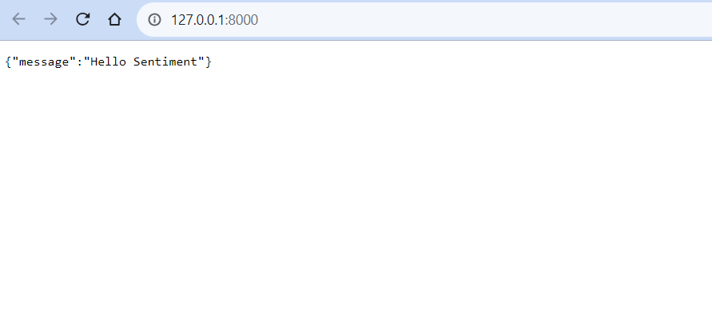
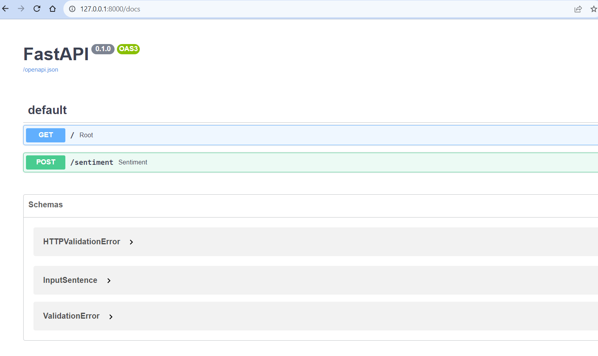
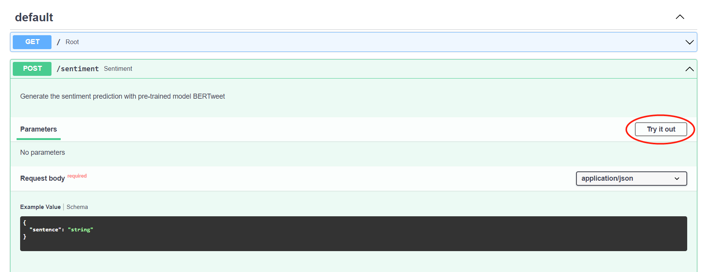
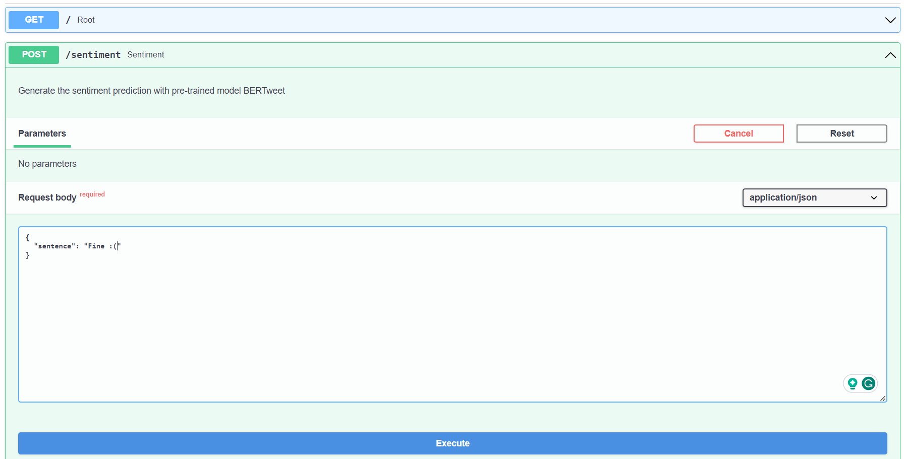
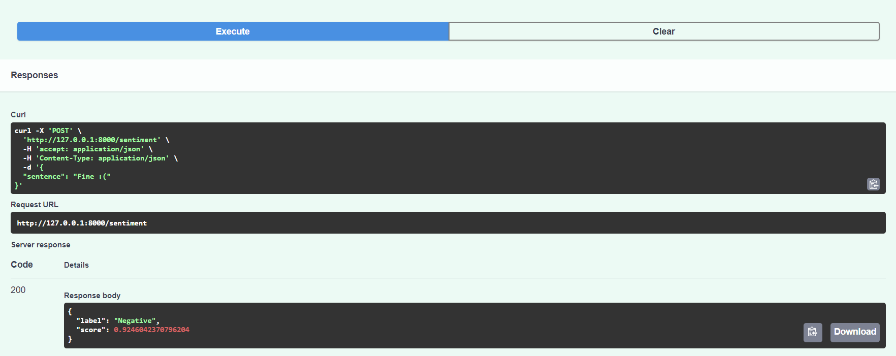

# BERTweet_FastAPI
This is a git remote add origin using the pre-trained NLP model (BERTweet) available on Huggingface (Python package: *transformer*) and using FastAPI to build an app on it
# Main Files
## util_get_sentiment.py
Function: sentiment_bertweet  
Input: a sentence (str)  
Output: sentiment label ('Positive', 'Neutral', 'Negative') and score predicted by BERTweet model
## try_tranformer_bertweet.ipynb
Step-by-step demonstration of how to get the pre-trained model from Huggingface and do the prediction  
Also demonstrating how to use sentiment_bertweet in util_get_sentiment.py  
BERTweet ability with Python package *emoji*
## main_python.py
Can be call in terminal with:
```console
$ python main_python.py --sentence "Sentence input"
```
## main.py
The FastAPI app, can be call in terminal with:
```console
$ uvicorn main:app --reload
```
"main" refers to main.py  
"app" refers to the app defined in main.py (app = FastAPI())  
"--reload" enables auto-reload  
Terminal output:
```console
$ INFO:     Uvicorn running on http://127.0.0.1:8000 (Press CTRL+C to quit)
```
Example of using the API:





# References
[Huggingface pipeline](https://huggingface.co/docs/transformers/main_classes/pipelines)  
[Huggingface BERTweet](https://huggingface.co/docs/transformers/model_doc/bertweet)  
[FastAPI first steps](https://fastapi.tiangolo.com/tutorial/first-steps/)